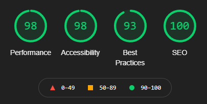

 
# Milestone Project 1 - KN Fitness
# Table of Contents
* [Introduction](https://github.com/KNFullStack/KN-Fitness#introduction)
* [User Experience Design](https://github.com/KNFullStack/KN-Fitness#user-experience-design)  
  * [User Stories](https://github.com/KNFullStack/KN-Fitness#user-stories)
    * [First Time Visitors](https://github.com/KNFullStack/KN-Fitness#first-time-visitors)
    * [Returning Visitors](https://github.com/KNFullStack/KN-Fitness#returning-visitors)
    * [Frequent Users](https://github.com/KNFullStack/KN-Fitness#frequent-users)
  * [Structure](https://github.com/KNFullStack/KN-Fitness#structure)
  * [Design](https://github.com/KNFullStack/KN-Fitness#design)
    * [Colors](https://github.com/KNFullStack/KN-Fitness#colors)
    * [Typography](https://github.com/KNFullStack/KN-Fitness#typography)
    * [Images](https://github.com/KNFullStack/KN-Fitness#images)
    * [Wireframes](https://github.com/KNFullStack/KN-Fitness#wireframes)
    * [Design Deviations](https://github.com/KNFullStack/KN-Fitness#design-deviations)
  * [Limitations](https://github.com/KNFullStack/KN-Fitness#limitations)
* [Features](https://github.com/KNFullStack/KN-Fitness#features)
  * [Current Features](https://github.com/KNFullStack/KN-Fitness#current-features)
  * [Future Features](https://github.com/KNFullStack/KN-Fitness#future-features)
* [Technologies](https://github.com/KNFullStack/KN-Fitness#technologies)
  * [Languages](https://github.com/KNFullStack/KN-Fitness#languages)
  * [Libraries, Frameworks & Programs Used](https://github.com/KNFullStack/KN-Fitness#libraries-frameworks--programs-used)
* [Testing](https://github.com/KNFullStack/KN-Fitness#testing)
  * [Validation](https://github.com/KNFullStack/KN-Fitness#validation)
    * [HTML Validation](https://github.com/KNFullStack/KN-Fitness#html-validation)
    * [CSS Validation](https://github.com/KNFullStack/KN-Fitness#css-validation)
  * [User Scenarios](https://github.com/KNFullStack/KN-Fitness#user-scenarios)
  * [Known Bugs](https://github.com/KNFullStack/KN-Fitness#known-bugs)
  * [Lighthouse Results](https://github.com/KNFullStack/KN-Fitness#lighthouse-results)
    * [Performance](https://github.com/KNFullStack/KN-Fitness#performance)
    * [Accessibility](https://github.com/KNFullStack/KN-Fitness#accessibility)
    * [Best Practices](https://github.com/KNFullStack/KN-Fitness#best-practices)
    * [SEO](https://github.com/KNFullStack/KN-Fitness#seo)
* [Deployment](https://github.com/KNFullStack/KN-Fitness#deployment)
  * [Publishing](https://github.com/KNFullStack/KN-Fitness#publishing)
  * [Forking](https://github.com/KNFullStack/KN-Fitness#forking)
  * [Local Clone](https://github.com/KNFullStack/KN-Fitness#local-clone)
* [Acknowledgements](https://github.com/KNFullStack/KN-Fitness#acknowledgements)
  * [Code](https://github.com/KNFullStack/KN-Fitness#code)
  * [Content](https://github.com/KNFullStack/KN-Fitness#content)
  * [Media](https://github.com/KNFullStack/KN-Fitness#media)
  * [Help](https://github.com/KNFullStack/KN-Fitness#help)
* [Further Comments](https://github.com/KNFullStack/KN-Fitness#further-comments)

You can find the published website here: [KN Fitness](link here)
# Introduction

The project is part of a Full Stack Developer course run by CodeInstitute. This is Milestone Project 1. This project was to create a website for a local, family run gym that is looking to reach out to new potential members in order to encourage more visits and memberships.

## KN Fitness Responsive Website

http://techsini.com/multi-mockup/index.php replace images below with this.

A mockup of the website can be seen below:

# User Experience Design
## User Stories
### First Time Visitors
* What would I want to see as a first time visitor?
  1. Understand where the gym is located and if that's a suitable location based on where I live, or my commute.
  2. Learn what type of gym-goer the gym is catered for, whether that's CrossFit type workouts, bodybuilding or cardio based workouts.
  3. In light of COVID-19, how visitors can maintain safety and what measures are in place to mitigate risks.
  4. Any other facilities on site that would be of benefit to me.
  6. The ability to easily navigate the website to find the information that is important.
### Returning Visitors
* What would I want to see as a returning visitor?
  1. I'd want to know more about the prices.
  2. I'd like to know if there are regular classes each day that I'd be interested in and what the schedule is.
  3. What the opening times are and if this fits my working patterns.
  4. How to get in contact with the gym.
  5. If there are any social media accounts to check out the gym further.
### Frequent Users
* What would I want to see as a frequent visitor?
  1. If the timetable has changed regarding classes.
  2. If there are any new personal trainers that have joined the team.
  3. A new featured product that I may be interested in.
  4. If there have been new images added to the gallery.
## Structure
Shown below are elements of the websites that correspond to potential User Stories:
* A navigation bar that is fixed to the top of the page.
> The ability to easily navigate the website to find the information that is important.
* A landing page with a call to action button for enquires.
> How to get in contact with the gym.
* A section describing the gym and current COVID-19 precautions
> In light of COVID-19, how visitors can maintain safety and what measures are in place to mitigate risks. Learn what type of gym-goer the gym is catered for, whether that's CrossFit type workouts, bodybuilding or cardio based workouts. Any other facilities on site that would be of benefit to me.
* A current featured product section.
> A new featured product that I may be interested in.
* General information including a class timetable, opening times, prices and personal trainers.
> I'd want to know more about the prices. I'd like to know if there are regular classes each day that I'd be interested in and what the schedule is. What the opening times are and if this fits my working patterns. If the timetable has changed regarding classes. If there are any new personal trainers that have joined the team.
* A gallery, showing images from the gym and its members.
> If there have been new images added to the gallery.
* Contact form and a map showing the gym's location.
> How to get in contact with the gym. Understand where the gym is located and if that's a suitable location based on where I live, or my commute.
* A footer containing links to the gym's social media pages.
> If there are any social media accounts to check out the gym further.

## Design
### Colors
The main colors for the website are black (#000000), white (#FFFFFF) and pastel-like red color (#B91546).
### Typography
The text throughout the website uses the **Roboto** font, while the headers use the **Bebas Neue** font.
### Images
The logo that has been created was made using [myfreelogomaker](https://myfreelogomaker.com/). Having the logo visible on all devices is important and therefore is shown on all devices on the left hand side of the navigation bar. Images were obtained from users on [Pexels](https://www.pexels.com/) and [Unsplash](https://unsplash.com/). See links to their profiles in the "Acknowledgements" section at the bottom of this README.
### Wireframes
Wireframes images can be seen below and also found in the "/assets/readme-content" folder. It contains a design for the desktop and mobile version of the website.

* Mobile:   
* Desktop:   

See links for PDF's below:
1. [Mobile Wireframe](/assets/readme-content/wireframe-mobile.pdf)
2. [Desktop Wireframe](/assets/readme-content/wireframe-desktop.pdf)

### Design Deviations
Compared to the original Wireframe there have been multiple deviations.
* The "Who are we?" section.
> Once this section was beginning to take shape, it was apparent that a 3x3 container with images and text content would not be an appropriate size, therefore it was reduced to a 2x2 container with 2 images and 2 text areas.
* A COVID-19 section in the "Who are we?" section, as one of the text boxes.
> A better way of displaying the information would be for it to take a row up for itself, to highlight the importance of this section, and to make it easier to see for people who have concerns about it, showing them that it is not a side thought.
* Personal Trainer section and a Gallery section.
> Again, once the project had started and the sections were being put together, it was obvious that a section highlighting the personal trainers and a section showing off some images of the gym and its members would be very beneficial. It would help users identify with the gym, the activities, and recognise some people at the gym upon their first visit.

These changes would bring a more positive experience to the user.

## Limitations
Currently there some limitations of the website. As shown below:
* There is no way to book classes.
* There is no way to purchase membership online, or to purchase products online.
* The contact form doesn't currently pass information anywhere.

# Features
## Current Features
Some of the key features incorporated into the website include responsiveness for multiple screen sizes and orientations. A fixed top navigation bar to allow easy navigation between the page sections and the content, this helps reduce the amount of scrolling needed to get to different sections, especially on mobile. This navigation bar collapses on smaller screen sizes. Certain objects are only visible on larger viewing windows to reduce the amount of scrolling required, such as increasing the number of of gallery images. An embedded map is also present to highlight the location of the gym.

## Future Features
Features that could be released in subsequent versions include:
* Enquires being sent straight to personal trainers instead of a general inbox.
* An online shop for products, or a page to highlight current products and special offers.
* A booking system to reserve space in classes.

# Technologies
Technologies used are as follows.
## Languages
* [HTML5](https://en.wikipedia.org/wiki/HTML5)
  * Used as the main language to code the website.
* [CSS3](https://en.wikipedia.org/wiki/CSS)
  * Used to incorporate custom styling into the website.

## Libraries, Frameworks & Programs Used
1. [Bootstrap 5](https://getbootstrap.com/docs/5.0/getting-started/introduction/)
   * Multiple features of Bootstrap 5 were utilised to create the website. Including grid system and responsiveness, the sticky navbar and collapsible links and to create the contact form.
2. [Balsamiq](https://balsamiq.com/)
   * Used to create the wireframes when starting the design.
3. [Font Awesome](https://fontawesome.com/)
   * Used for multiple icons throughout the website. 
4. [Google Fonts](https://fonts.google.com/)
   * Used to incorporate the fonts "Bebas Neue" by Ryoichi Tsunekawa and "Roboto" by Christian Robertson.
5. [Git](https://git-scm.com/)
   * Used for version control to add, commit, and push files to GitHub.
6. [GitHub](https://github.com/)
   * Used as a storage location for the website's content, including code and assets.
7. [GitPod](https://www.gitpod.io/)
   * An online IDE used to write and test code that is written.
8. [Techsini](http://techsini.com/multi-mockup/index.php)
   * Used to generate the mockup image in this README file, see above.
9. [Chrome Dev Tools](https://developer.chrome.com/docs/devtools/)
   * Used to test different CSS styles in the browser, inspect pages for more information about elements and general debugging.
10. [favicon.cc](https://www.favicon.cc/)
   * Used to create the favicon.ico.
11. [TinyJPG](https://www.tinyjpg.com/)
   * Used to reduce the size of images used.

# Testing

Due to the website having no backend functionality, the testing procedure is based on the visual aspect of the website. High level testing includes:
* Running the website on 3 different browsers and simulating responsiveness on each, varying screen sizes will be simulated, ranging from a minimum width of 300px to a maximum width of 3000px:
  * Google Chrome
  * Mozilla Firefox
  * Opera
* No layout items in the containers overlapping other layout items.
* Links in the navigation bar to take the user to the correct section.
* External links to open in a new tab.
* Contact form to require an input in each field prior to submission.
* Buttons display a hover effect.
* Website is designed according to the wireframes made prior to coding.

Test Results can be found here: [Test Results](/assets/readme-content/test-result.xlsx)

## Validation
### HTML Validation
"index.html" was run through the [W3C HTML Validator](https://validator.w3.org/), via the direct input method. Errors regarding use of H1 elements throughout multiple sections and unclosed DIV elements were highlighted. Both these issues were corrected and putting "index.html" through the validator again now returns no errors or warnings.
### CSS Validation
CSS Stylesheet was run through the [W3C CSS Validator](https://jigsaw.w3.org/css-validator/), via the direct input method and no errors were found.
## User Scenarios - Testing
How does the website design enable the goals of a first time, returning and frequent user? 
### First Time User
* Understand where the gym is located and if that's a suitable location based on where I live, or my commute.
  * Testing the "CONTACT" button takes the user to a section containing a map that shows the gym's location, along with the address.
* Learn what type of gym-goer the gym is catered for, whether that's CrossFit type workouts, bodybuilding or cardio based workouts.
  * "Who are we?" section appears after scrolling down and allows the user to get a feel for what the gym offers and working links allow easy navigation.
* In light of COVID-19, how visitors can maintain safety and what measures are in place to mitigate risks.
  * COVID-19 section showing the current rules in place at the gym with an external link that opens in a new tab for more information.
* Any other facilities on site that would be of benefit to me.
  * Also in the "Who are we?" section. Easily found by scrolling or the navigation bar.
* The ability to easily navigate the website to find the information that is important.
  * All links testing and working to allow the user to navigate easily through the pages.
### Returning User
* I'd want to know more about the prices.
  * Working dropdown menu under "INFO" section of navigation bar displays a new link for "MEMBERSHIPS". All links tested and working.
* I'd like to know if there are regular classes each day that I'd be interested in and what the schedule is.
  * Working dropdown menu under "INFO" section of navigation bar displays a new link for "TIMETABLE". All links tested and working.
* What the opening times are and if this fits my working patterns.
  * Working dropdown menu under "INFO" section of navigation bar displays a new link for "OPENING TIMES". All links tested and working.
* How to get in contact with the gym.
  * Testing the "CONTACT" button takes the user to a contact form to be able to select their query type and send a message.
* If there are any social media accounts to check out the gym further.
  * The very bottom of the page display the social media accounts. These have been tested to ensure they open to the correct website and in a new tab.
### Frequent User
* If the timetable has changed regarding classes.
  * Working dropdown menu under "INFO" section of navigation bar displays a new link for "TIMETABLE". All links tested and working.
* If there are any new personal trainers that have joined the team.
  * Working dropdown menu under "INFO" section of navigation bar displays a new link for "PERSONAL TRAINERS". All links tested and working.
* A new featured product that I may be interested in.
  * Large section in the "Who are we?" section that display information regading the current featured product along with some descriptive information.
* If there have been new images added to the gallery.
  * "GALLERY" link that takes the user quickly to the gallery section of the website. Link tested and working.

## Known Bugs
1. Featured product image was not resizing correctly on smaller viewing windows. The image appeared distorted but has been corrected.
   * Corrected by removing the height property in the image's ID selector.
2. Fixed top navigation bar caused the user to be taken too far down the page when clicking links.
   * This was corrected by the using the CSS property "scroll-margin-top", which I learned about on [stackoverflow](https://stackoverflow.com/). See Acknowledgments for details.

## Lighthouse Results
Images below show the Lighthouse results on both mobile and desktop:
1. Mobile: 
1. Desktop: 
### Performance
Initially a lower score was given for the Performance category, which was 80. The cause for this was the image sizes. [TinyJPG](https://www.tinyjpg.com/) was used to reduce the file sizes of these images, which increased the score.
### Accessibility
The text of the "Enquire now!" button in the landing page was originally white. This was flagged as a contrast issue and therefore changed to black to make it easier to read.

# Deployment
## Project creation
To create the project, firstly a Chrome extension called "[Gitpod - Always ready to code](https://chrome.google.com/webstore/detail/gitpod-always-ready-to-co/dodmmooeoklaejobgleioelladacbeki?hl=en-GB)" was installed. A CodeInstitute template was use by navigating to the [GitHub Repo](https://github.com/Code-Institute-Org/gitpod-full-template) and clicking the "Use this template" button. The repository was named "KN-Fitness", the checkbox for "Include all branches" was checked and the green "Create repository from template" button was then clicked. From here, the green "GitPod" was then clicked (must use the above extension) and project folders and files created.

Common Git commands were used as follows:
* git add "filename-here" - used to stage files before commiting them.
* git commit -m "message here" - used to commit changes to the local repositry, with the message containing information on the changes that have occured.
* git status - used to check the tracking status of the file in the project.
* git push - used to push the changes to the GitHub repository.

## Publishing
To publish the project I performed the following steps:
## Local Clone
To create a local clone of the project you can follow the steps below:

# Acknowledgements
Would like to say thank you to my mentor Spencer Barriball for his help and guidance throughout the project.
## Code
Fixed top navigation bar caused links to scroll down the page too far to view the relevant content. Learned about the CSS property "scroll-margin-top", thanks to user "Skeets" on [stackoverflow](https://stackoverflow.com/questions/11501025/div-anchors-scrolling-too-far). 
## Media
Many thanks to the image contributors of [Pexels](https://www.pexels.com/) and [Unsplash](https://unsplash.com/).
* "hero-image.jpg" courtesy of [Leon Ardho](https://www.pexels.com/@leonardho).
* "crossfit.jpg" courtesy of [John Arano](https://unsplash.com/@johnarano).
* "kettlebell-class.jpg" courtesy of [Ambitious Creative Co - Rick Barrett](https://unsplash.com/@weareambitious).
* "squat-rack.jpg" courtesy of [Alexander Redl](https://unsplash.com/@alexanderredl).
* "protein-bar.jpg" courtesy of [Hayley Maxwell](https://unsplash.com/@hayleymaxwell).
* "gallery1.jpg" courtesy of [Victor Freitas](https://unsplash.com/@victorfreitas).
* "gallery2.jpg" courtesy of [Victor Freitas](https://unsplash.com/@victorfreitas).
* "gallery3.jpg" courtesy of [Ambitious Creative Co - Rick Barrett](https://unsplash.com/@weareambitious).
* "gallery4.jpg" courtesy of [Dor Farber](https://unsplash.com/@dor_farber).
* "gallery5.jpg" courtesy of [Jesper Aggergaard](https://unsplash.com/@aggergakker).
* "gallery6.jpg" courtesy of [Francesca Hotchin](https://unsplash.com/@franhotchin).
* "pt1.jpg" courtesy of [Jonathan Borba](https://unsplash.com/@jonathanborba).
* "pt2.jpg" courtesy of [Rinke Dohmen](https://unsplash.com/@rinked).
* "pt3.jpg" courtesy of [Omid Armin](https://unsplash.com/@omidarmin).
# Further Comments